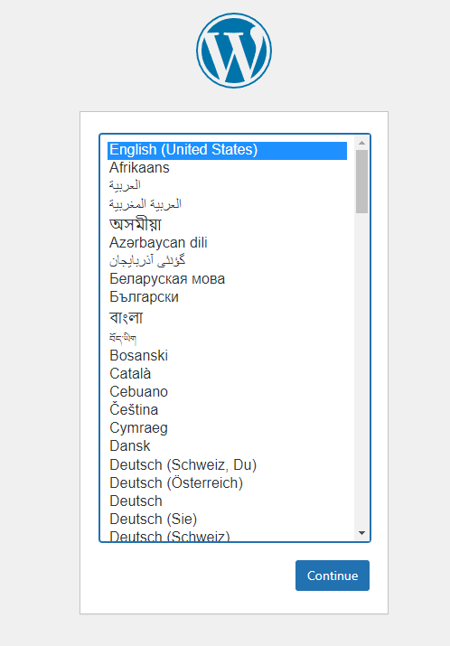
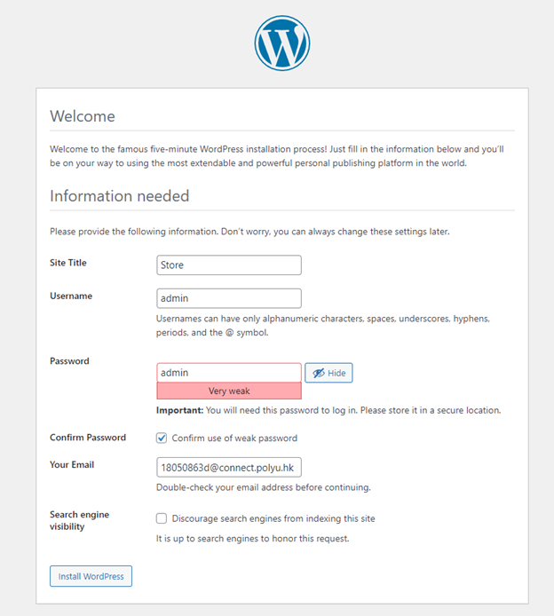
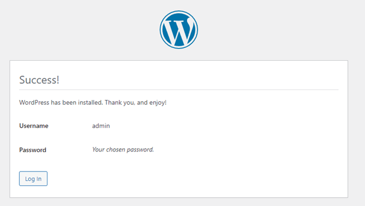
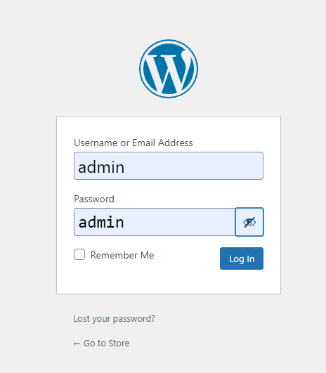

# Wordpress setup and installation of WooCommerce

## Pulling project

Clone the WordPress from github. 
`git clone https://github.com/polyu18046521d/wordpress-shop`{{execute}}

Execute:

`cd wordpress-shop`{{execute}}

`docker-compose up`{{execute}}

Wait until the docker images are built and various containers have started up.

## Setup Wordpress

Go to the WordPress at localhost:8080:

https://[[HOST_SUBDOMAIN]]-8080-[[KATACODA_HOST]].environments.katacoda.com

### Do the following
Then select the language as "English(United States)"

Set the store with data of yours. 

Example: 

Site title: Store

Username: admin

Password: admin

tick the box "Confirm use of weak password"

Email: 18050863d@connect.polyu.hk

Press "Install WordPress"

After confirming credentials,

Press "log in"

Getting into Wordpress,

Press "log in" with the username and password initialized before 

Then you should have WordPress ready to use. 