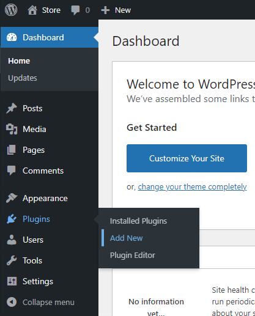

# Installation of WooCommerce and Stripe

## Setup WooCommerce

In the left column find "Plugins", under "Plugins" press "Add New". 

In the top right corner, in "Search plugins...", type "WooCommerce". Install the WooCommerce. 

Wait for the download and press "Activate". 

Then you will be redirected to setup the WooCommerce. 

### Store Details 
Input some information about the shop. 

Example:

Set the address line 1 to “Hong Kong”

Choose the Country/ Region as “Hong Kong – Hong Kong Island”

Set the City as Hong Kong

Set the post code as 0000

Email address as 18050863d@connect.polyu.hk 

Press confirm then press “Yes, count me in”

### Industry
Pick the correct one for the shop. 

Example:

Tick the box for “Education and learning”

Press "Continue" 

### Product Types
Pick the correct one for the shop. 

Example:

Tick the box “Physical products”

Press "Continue" 

### Business Details
Pick the correct one for the shop. 

For the first question “How many products do you plan to display?”, choose “11-100”.

For the second question “Currently selling elsewhere”, choose “No”

Press "Continue" 

Then press "Continue" again after seeing the free feature. 

### Theme 
Select a theme that interests you. 

Example:

Press “Continue with my active theme” 

Then you will have your WooCommerce set up and ready to use. 

## Stripe

On the left column, go to WooCommerce, find “Settings”. 

Under "Settings", find “Payments”.

Scroll down and find “Stripe Payments”. Press "Get started".  Then press "Save changes" at the bottom of the pages.

Tick the box “Enable Stripe”.

Then press "Save changes" at the bottom of the pages.

Then you will see "Your settings have been saved."

Now, Stripe is on and ready to use. It will be the payment gateway of your store. 

