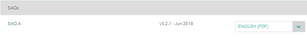

# PCI DSS Self-Assessment Questionnaire (SAQ)

## What is SAQ?
There are two components to the Self-Assessment Questionnaire:

1.	A set of questions corresponding to the PCI Data Security Standard requirements designed for service providers and merchants.

2.	An Attestation of Compliance or certification that you are eligible to perform and have performed the appropriate Self-Assessment. An appropriate Attestation will be packaged with the Questionnaire that you select.

## Which SAQ is suitable for the shop?
SAQ A is suitable for the shop because stripe is used as the payment gateway and the shop is classfied as Card-not-present merchants (e-commerce or mail/telephone-order) that have fully outsourced all cardholder data functions to PCI DSS compliant third-party service providers, with no electronic storage, processing, or transmission of any cardholder data on the merchant’s systems or premises.

## The SAQ
The SAQ could be found:

https://www.pcisecuritystandards.org/document_library?category=saq&document=saq

Click on the “SAQ A” with “ENGLISH(PDF)” as the format. Finish the questions of the SAQ and AOC. 

Upon completion, you only need to keep your  SAQ and Attestation of Compliance (AOC), along with any other requested documentation—such as ASV scan reports on file and ready to send to an “Enforcing Organization” (such as an acquiring bank [the bank that actually process your credit card transactions] or your merchant service provider) on request.

## Regular Review
A review annualy is needed to be done to make sure the shop is operating according to the content of the SAQ. 

## Being PCI DSS compliant
After the completion of the SAQ and AOC, the shop are qualified to be claimed as PCI DSS compliant.