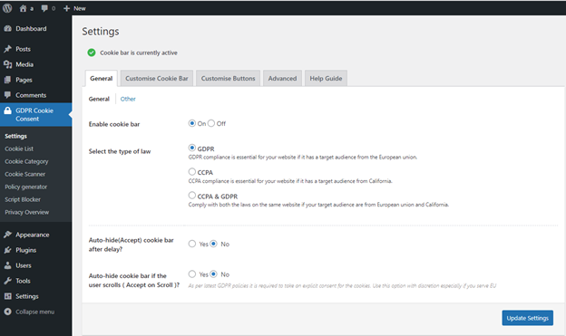

# To be GDPR compliant

## Privacy policy
### Data Protection Officer
A Data Protection Officer is a formal role required by the GDPR. The Data Protection Officer should  take charge of your business’ data protection strategy and compliance, and"

1. Decide how customers should make privacy-specific requests. 

2. Update the privacy policy with how you use and store data, and why.

3. Prepare for and respond to the requests from the customers that are from the rights granted by the GDPR 

4. Prepare for and respond to security breaches.

5. Keep attuned to future changes in privacy laws

### To create or update the Privacy Policy
In the left column find "Settings", under "Settings" press "Privacy".

Then press "edit" to amend the privacy policy and establish the policy of your shop. 

Things to be included：

#### What data does this store collect about the customers?

Noting all the fields of the data, especially personal information collected by the store. 

#### What does this store do with customers data and why?

Examples:

Email to communicate and update order status

Address for shipping

#### Who does this store share the customers data with?

Examples are payment gateways, plugins and so on. 

#### How long does this store keep the data of the customers?

Examples: 

Keeping for a year for tax audition 

#### How can the customers access, update, or delete the collected data or use the right granted by GDPR?

Provide ways to allow the customers to use their rights granted by the GDPR

#### State under which basis the shop are doing each kind of processing of personal data.

Examples: 

Consent, Contractual necessity, Compliance with legal obligations or Legitimate interests.

Examples of the private policy:

Then, in the top right corner press "Publish" or "Update" to finish editing the Privacy Policy. 

### Showing the privacy policy on the page
In the left column find "Appearance", under "Appearance" press "Widgets".

Go to "Add block" which is a + symbol and search "Navigation Menu"

Then a new block of "Navigation Menu" stating that there is no menus have been created yet will pop up. Press "Create some".

Then, you will be redirected to another page which is "Menus" under "Appearance".

Name the "Menu Name" Privacy Policy and tick the Display location as "Primary Menu". Press "Create Menu".

Press View all and tick Privacy Policy — Privacy Policy. Then press "Add to Menu".

Then "Privacy Policy" will be shown in Menu structure. Press "Save Menu".

Then message of succesful update will be shown.

## Consent management, cookie
Consent management is the act or process of managing consents from your users and customers for processing their personal data.

In other words, consent management means to enable for your users the ability to opt-in and out of the specific cookie categories (preferences, statistics and marketing), to consent and to withdraw their consent again if they chose to. 

In the left column find "Plugins", under "Plugins" press "Add New". 

In the top right corner, in "Search plugins...", type "CookieYes". Install the CookieYes. 

Wait for the download and press "Activate". 

Then you will have the CookieYes working for you.

The plugin will automatically start gathering consent from your visitors.

In addition you will get detailed reports which show you how your visitors are behaving with the consent layer, how many consents you get. 

### The customer view for privacy policy and cookies message pop up

Top right to access the privacy policy and bottom to see the cookie message pop up. 

### The right to be informed & The right to object

The consent management also satisfies the right of the customers granted by the GDPR namely the right to be informed & the right to object.

The right to be informed:

Individuals have the right to be informed about the collection and use of their personal data. The cookies notify the users that their data is collected. 

The right to object:

This also gives them the right to object where customers can always object to their data being used for any purpose by not giving their consent and reject the cookies. 

Therefore, the cookies which is the consent manager would help to satisfy the consent management required by the GDPR and the right to be informed & the right to object of the customers.